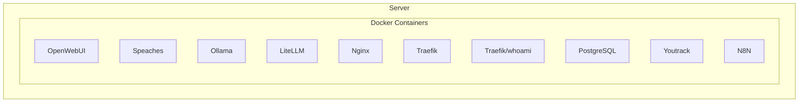

# Homelab Service Access Reference

This is the beginning  of a stack i wan to deploy. Help me extend the graph 

## Web Services Access Table

| Service | URL | Port (External) | Description | Authentication |
|---------|-----|----------------|-------------|----------------|
| Traefik Dashboard | `https://traefik.local` | 443 | Edge router management interface | Basic Auth (admin) |
| Nginx | `https://nginx.local` | 443 (or direct 8443) | Legacy reverse proxy | None by default |
| Static Content | `https://static.local` | 443 | Static file hosting | None by default |
| Whoami | `https://whoami.local` | 443 | Demo service showing request info | None |
| Portainer | `https://portainer.local` | 443 | Container management UI | Admin account required |
| Prometheus | `https://prometheus.local` | 443 | Metrics collection and storage | Basic Auth (admin) |
| Grafana | `https://grafana.local` | 443 | Metrics visualization dashboards | Admin account (default: admin/securepassword) |
| Ollama | `https://ollama.local` | 443 | Self-hosted LLM runtime | None by default |
| Open WebUI | `https://chat.local` | 443 | Web interface for Ollama LLMs | Username/password |
| n8n | `https://n8n.local` | 443 | Workflow automation platform | Basic Auth (admin) |

## Direct Port Access

| Service | Host Port | Container Port | Protocol | Notes |
|---------|-----------|----------------|----------|-------|
| Traefik | 80 | 80 | HTTP | Redirects to HTTPS |
| Traefik | 443 | 443 | HTTPS | Primary web access |
| Traefik Metrics | 8082 | 8082 | HTTP | Internal only (monitoring network) |
| Nginx | 8081 | 80 | HTTP | Direct access to Nginx |
| Nginx | 8443 | 443 | HTTPS | Direct SSL access to Nginx |
| Ollama | 11434 | 11434 | HTTP | Direct API access for LLM |

## Network Configuration

* All web services are accessible through Traefik's HTTPS endpoint on port 443
* Services on the `frontend` network are externally accessible
* Services on the `backend` network are only accessible internally
* Services on the `monitoring` network are reserved for metrics collection
* Ollama is accessible directly via port 11434 for API access from other applications

## AI Platform Configuration

| Service | URL | Purpose | Models |
|---------|-----|---------|--------|
| Ollama | `https://ollama.local` | LLM inference API | User-installed models |
| Open WebUI | `https://chat.local` | Chat interface for Ollama | Connects to Ollama backend |

## Security Notes

* All web traffic is automatically redirected to HTTPS
* Security headers are applied to all HTTP responses
* Administrative interfaces require authentication
* Default credentials should be changed before deployment
* Domain suffix `.local` can be customized via the `LOCAL_DOMAIN` environment variable
* Open WebUI requires secure authentication credentials to be set
* n8n uses encryption keys that must be properly secured